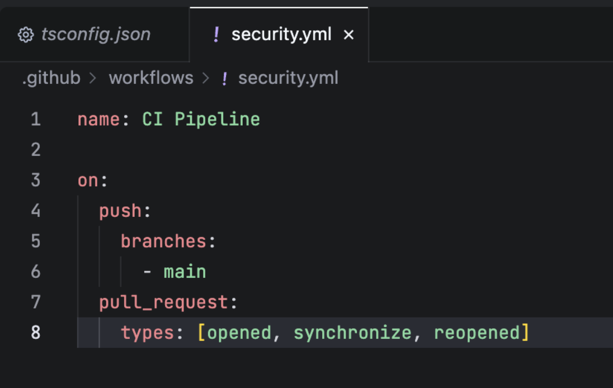
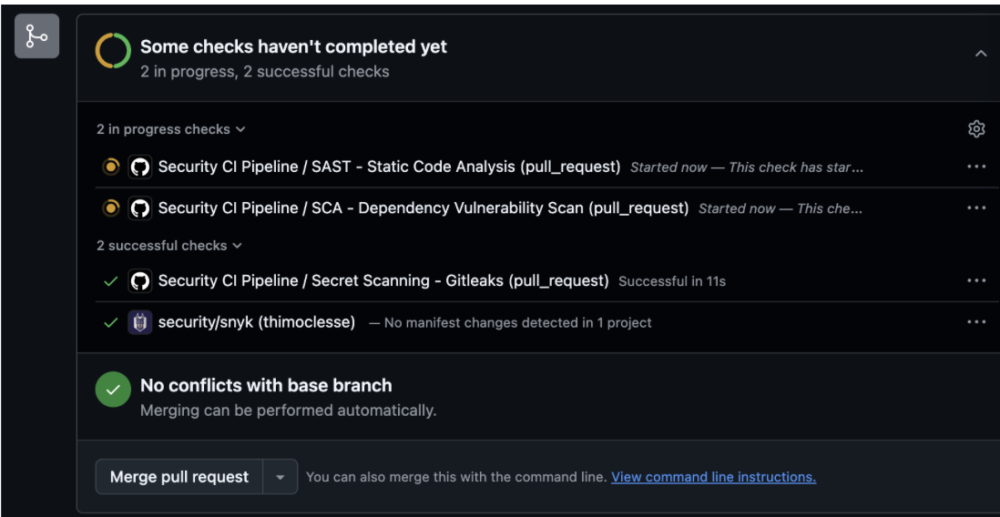
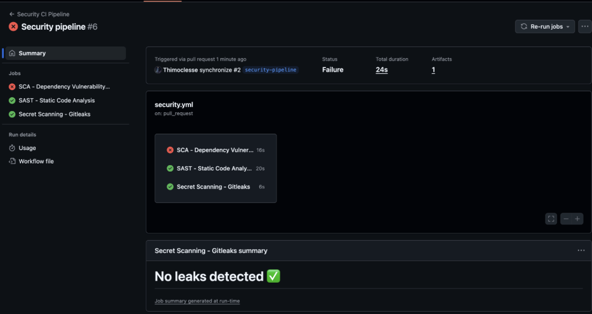
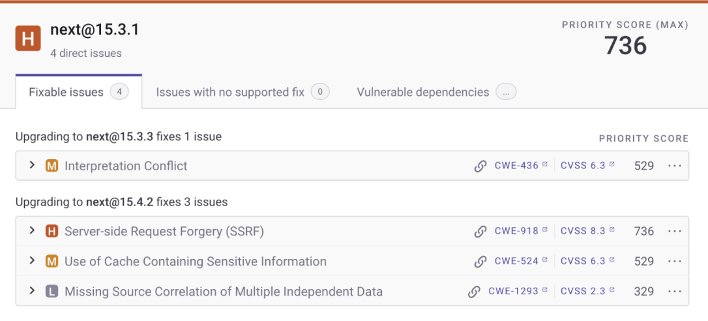
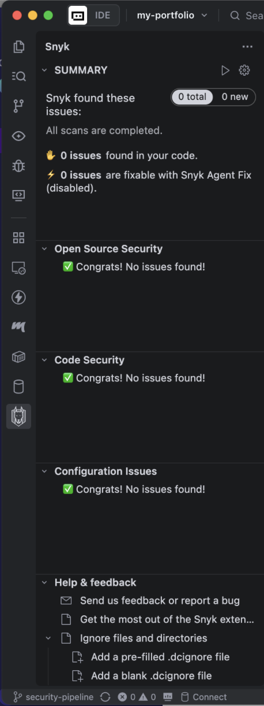

# My Portfolio

A personal portfolio website built with Next.js, showcasing projects, a timeline of my journey, and interactive UI components.

## Tech Stack

- Next.js `^16.0.4`
- React `^19.2.0`
- TypeScript `^5`
- Tailwind CSS `^4` with `tailwind.config.ts` and `@tailwindcss/postcss`
- Motion / Framer Motion `^12.9.1` for animations

## Requirements

- Node.js `>= 18.18` (Node 20 LTS recommended)
- npm (or Yarn/PNPM/Bun if preferred)

## Setup

1. Install dependencies:
   ```bash
   npm install
   ```
2. Start the development server:
   ```bash
   npm run dev
   ```
3. Open `http://localhost:3000` in your browser.

## Build and Run

- Build production assets:
  ```bash
  npm run build
  ```
- Start the production server:
  ```bash
  npm start
  ```

## Scripts

- `npm run dev` — start the Next.js dev server
- `npm run build` — build for production
- `npm start` — run the production build
- `npm run lint` — run ESLint

## Notes

- Main entry is in `app/page.tsx`.
- Styling via Tailwind; configuration in `tailwind.config.ts` and PostCSS in `postcss.config.mjs`.


## GitHub Actions: [`security.yml`](.github/workflows/security.yml)


This repository uses a security-focused CI workflow to continuously check for risks.

- Triggers: on `push` and `pull_request` to `main`, plus a daily `schedule`.
- Reports: results appear on Pull Requests and in the repo Security tab.

### Jobs Overview

- SCA analysis : Identifies open-source components and vulnerabilities in software dependencies.
- Secret scanning : Detects exposed credentials, keys, and sensitive information in code.
- SAST analysis : Examines source code to find security flaws early development.


## Creation of the security.yml file



## First run of the tests 


## Dependencies issiues


## Report on snyk (should upgrade next on my project)


## Snyk directly on the project
