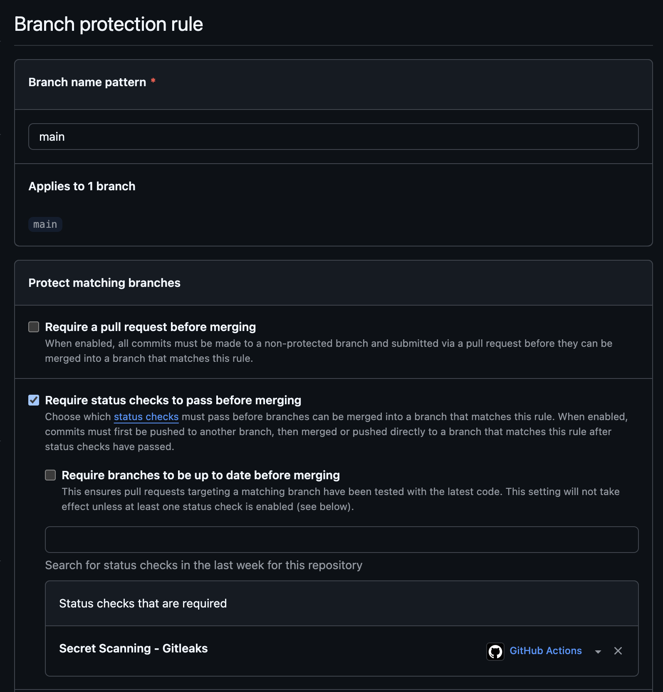

# My Portfolio

A personal portfolio website built with Next.js, showcasing projects, a timeline of my journey, and interactive UI components.

## Tech Stack

- Next.js `^16.0.4`
- React `^19.2.0`
- TypeScript `^5`
- Tailwind CSS `^4` with `tailwind.config.ts` and `@tailwindcss/postcss`
- Motion / Framer Motion `^12.9.1` for animations

## Requirements

- Node.js `>= 18.18` (Node 20 LTS recommended)
- npm (or Yarn/PNPM/Bun if preferred)

## Setup

1. Install dependencies:
   ```bash
   npm install
   ```
2. Start the development server:
   ```bash
   npm run dev
   ```
3. Open `http://localhost:3000` in your browser.

## Build and Run

- Build production assets:
  ```bash
  npm run build
  ```
- Start the production server:
  ```bash
  npm start
  ```

## Scripts

- `npm run dev` — start the Next.js dev server
- `npm run build` — build for production
- `npm start` — run the production build
- `npm run lint` — run ESLint

## Notes

- Main entry is in `app/page.tsx`.
- Styling via Tailwind; configuration in `tailwind.config.ts` and PostCSS in `postcss.config.mjs`.


## GitHub Actions: [`security.yml`](.github/workflows/security.yml)


This repository uses a security-focused CI workflow to continuously check for risks.

- Triggers: on `push` and `pull_request` to `main`, plus a daily `schedule`.
- Reports: results appear on Pull Requests and in the repo Security tab.

### Jobs Overview

- **SCA** : Scan des dépendances pour détecter les vulnérabilités dans les packages open-source.
- **SAST** : Analyse statique du code source pour identifier les failles de sécurité.
- **Secret scanning** : Détection des credentials, clés API et informations sensibles exposées dans le code.

### Actions Performed

#### Workflow Configuration

**Triggers** :
- `push` : Triggered on `main` and `dev` branches
- `pull_request` : Triggered when opening, synchronizing, or reopening PRs to `main` and `dev`

**Behavior** :
- On `main` : Scans are blocking (the workflow fails if vulnerabilities are found)
- On `dev` : Scans are non-blocking (`continue-on-error: true`) to allow iterative development

#### Job: SCA (Software Composition Analysis)

1. **Checkout code** : `actions/checkout@v4`
   - Retrieves the repository source code in the CI environment

2. **Install Snyk** : `npm install -g snyk`
   - Installs the Snyk CLI tool globally to scan dependencies

3. **Authenticate Snyk** : `snyk config set api="$SNYK_TOKEN"`
   - Configures Snyk authentication with the token stored in GitHub secrets
   - Uses the `SNYK_TOKEN` environment variable from `secrets.SNYK_TOKEN`

4. **Run Snyk SCA Scan** : `snyk test --all-projects`
   - Scans all projects in the repository (automatically detects manifests: `package.json`, `requirements.txt`, etc.)
   - Identifies known vulnerabilities in open-source dependencies
   - Compares installed versions with the Snyk vulnerability database

#### Job: SAST (Static Application Security Testing)

1. **Checkout code** : `actions/checkout@v4`
   - Retrieves the repository source code

2. **Install Snyk** : `npm install -g snyk`
   - Installs the Snyk CLI tool

3. **Authenticate Snyk** : `snyk config set api="$SNYK_TOKEN"`
   - Configures authentication with the Snyk token

4. **Run Snyk Code (SAST)** : `snyk code test`
   - Statically analyzes source code (TypeScript, JavaScript, etc.)
   - Detects common security flaws (SQL injections, XSS, weak authentication, etc.)
   - Uses data flow analysis and known vulnerability patterns

#### Job: Secret Scanning

1. **Checkout code** : `actions/checkout@v4` with `fetch-depth: 0`
   - Retrieves source code with full Git history
   - `fetch-depth: 0` is necessary for Gitleaks to scan the complete history and detect secrets even if they were removed in previous commits

2. **Run Gitleaks Scan** : `gitleaks/gitleaks-action@v2`
   - Uses Gitleaks to scan Git history and current code
   - Detects secret patterns (API tokens, private keys, passwords, etc.)
   - Uses `GITHUB_TOKEN` to access repository information
   - Scans all commits to detect secrets even if they were removed

### Branch Protection Rules

Branch protection rules have been configured to enhance security:

**Required configuration** :
- The security workflow must pass successfully before merge
- Protection against direct merges to `main` without PR
- Mandatory validation of security checks



#### Artifacts

Each security scan generates artifacts that can be downloaded from GitHub Actions:

**Where to find artifacts** :
1. Go to the **Actions** tab in your GitHub repository
2. Click on a workflow run (e.g., "Security CI Pipeline")
3. Scroll down to the **Artifacts** section at the bottom of the workflow run page
4. Download the available artifacts:
   - **`sca-report`** : JSON report containing dependency vulnerability scan results
   - **`sast-report`** : SARIF file with static code analysis findings
   - **`secrets-report`** : HTML report showing detected secrets and credentials

**Note** : Artifacts are retained for 90 days by default and can be downloaded for detailed analysis of security findings.


## Creation of the security.yml file


## First run of the tests 


## Dependencies issiues


## Report on snyk (should upgrade next on my project)

After update, no problems anymore

## Snyk directly on the project

